# 03. Руководство администратора

**Роль:** `admin` (полный рабочий доступ) или `superadmin` (то же + управление
пользователями и ролями). Администратору доступны **все** разделы панели.

> Скриншоты в этом руководстве сняты с реальной панели (демо-данные).
> Ваш экран может отличаться составом данных, но не устройством разделов.

---

## Вход в панель

Адрес: `http://10.0.119.100/`. Логин и пароль выдаёт супер-админ; при первом
входе со стандартным паролем панель **принудительно попросит сменить пароль**.

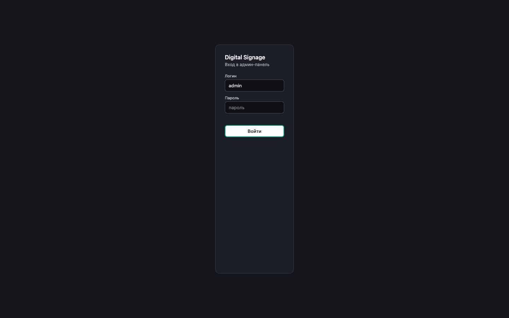

Разделы слева: Дашборд · Эфир сети · Бегущая строка · Экраны · Медиатека ·
Плейлисты · Расписание · Кампании · Модерация · Отчёты · Биллинг ·
Обновление агентов · Настройки.

---

## Дашборд

Общее состояние сети в реальном времени (обновляется по WebSocket, без
перезагрузки страницы).

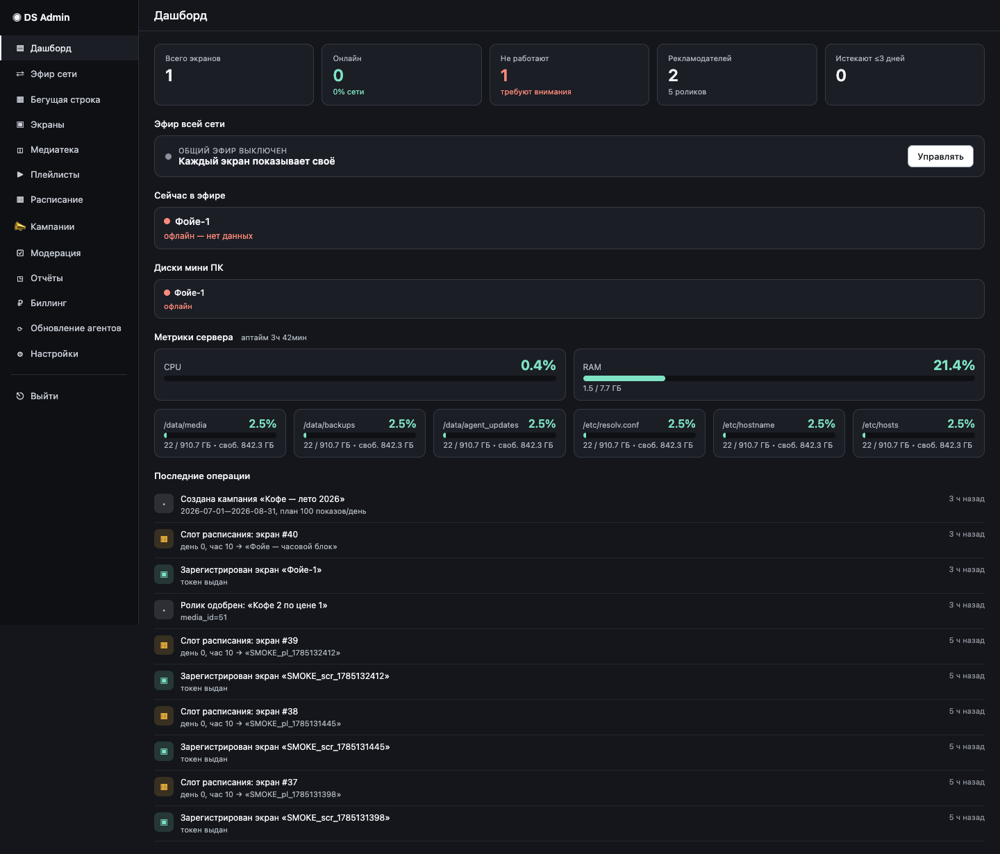

- **Плитки KPI**: всего экранов · онлайн · не работают · рекламодателей ·
  роликов, у которых срок действия истекает в ближайшие ≤3 дней (они тихо
  пропадут из эфира — успейте продлить или заменить).
- **Эфир всей сети**: включён ли общий эфир; кнопка «Управлять» ведёт в раздел
  «Эфир сети».
- **Что играет сейчас** на каждом экране; **диски мини-ПК** (свободное место).
- **Метрики сервера**: CPU, RAM, диски, аптайм.
- **Последние операции** — лента журнала действий (аудита).
- Ниже — **нерабочие ролики** (файлы, на которых плеер спотыкается) и
  истекающие ролики.

---

## Экраны

Учёт мини-ПК, их группы и команды управления.

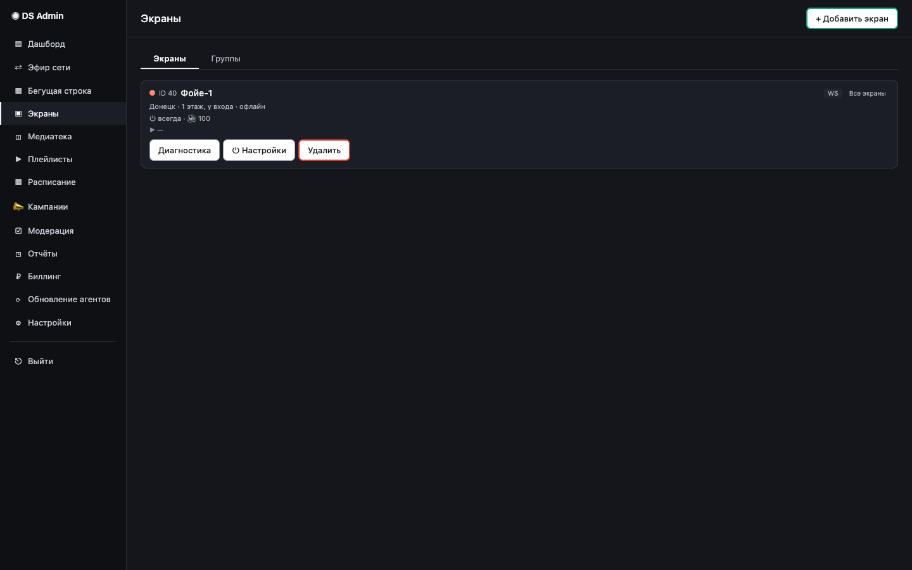

- **+ Добавить экран** → имя/город/размещение → «Создать и получить токен».
  Скопируйте **токен** и запомните **ID** — они нужны при установке агента
  (см. [02_УСТАНОВКА_АГЕНТ](02_УСТАНОВКА_АГЕНТ.md)).
- **Тип площадки** у каждого экрана: *Прочее / Магазин / Магазин с
  алколицензией / Торговый центр / Офис*. Управляет допуском рекламы по 38-ФЗ
  (алкоголь — только «Магазин с алколицензией», ст. 21).
- **Группы экранов** («+ Создать группу», добавить/убрать экран): на группу
  удобно назначать общее расписание. Новый экран без группы автоматически
  попадает в служебную группу «Все экраны».
- **Команды экрану** (доставляются мгновенно по WebSocket; индикатор показывает,
  активен ли push или агент работает по опросу):
  - **■ Стоп** — остановить показ; **▶ Показ** — возобновить по расписанию
    (без перезапуска агента);
  - **▶ Запустить** / **▶ Синхростарт** — запуск показа, в т.ч. синхронный на
    нескольких экранах;
  - **↺ Агент** — перезапустить службу `ds-agent` на мини-ПК.
- **Телеметрия на карточке** (heartbeat ~30 с): свободный диск, версии
  ОС/плеера, разница часов, «что играет».
- **🧾 Диагностика** — по кнопке агент собирает архив логов (journalctl,
  ds-agent.log, конфиг без токена, версии, диск, состояние плеера и часов)
  и присылает на сервер (~15–30 с); список архивов появляется под строкой
  экрана, каждый можно скачать. Хранятся последние 5 архивов на экран.
  Если экран офлайн — команда выполнится, когда он выйдет на связь
  (резерв: скрипт на самом мини-ПК `bash /opt/ds-agent/collect_diag_agent.sh`).
- **⏻ Настройки** (кнопка на строке экрана) — питание монитора по расписанию
  (время вкл/выкл МСК, пусто = всегда включён) и громкость день/ночь
  (0–100, с границами ночи). Текущий режим виден бейджем на строке
  (`⏻ всегда` или `⏻ 08:00–22:00`).
- **Часы**: панель показывает разницу между часами сервера и мини-ПК — если
  она растёт, проверьте NTP (см. runbook).
- **📺 Монитор** — бейдж подключения монитора к видеовыходу мини-ПК:
  зелёный — монитор виден, **красный — кабель HDMI/DisplayPort отсоединён
  или монитор обесточен** (мини-ПК при этом «онлайн и играет», но зрителю
  ничего не видно), серый — состояние неизвестно (агент старее 1.2.0 либо
  драйвер не сообщает статус). У красного бейджа под карточкой появляется
  строка «⚠ Монитор отключён от видеовыхода» со временем, когда это
  случилось; такие экраны также собраны на Дашборде в блоке «Монитор не
  подключён» и, если включено, уходят уведомлением в MAX.
  Наведите курсор на бейдж — во всплывающей подсказке видны все выходы
  (например `HDMI-A-1:connected, DP-1:disconnected`).
  Метод определяет **наличие кабеля/EDID**, а не «картинку»: монитор,
  выключенный кнопкой, часто продолжает отвечать и остаётся зелёным.

---

## Медиатека

Хранилище всех роликов. Структура: **Общая медиатека** (без привязки к
рекламодателю) · **Заглушки** (служебные заставки) · **рекламодатели → папки →
файлы**.

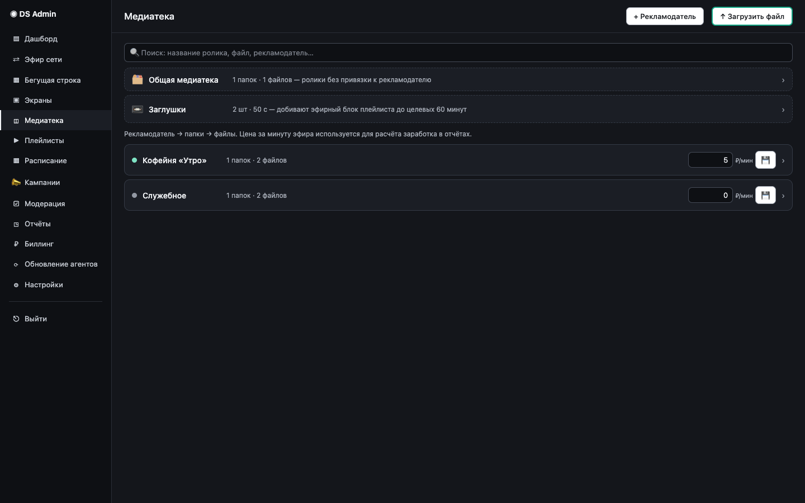

- Медиатека не хранит окончательную цену размещения: тариф, цена и ручная
  скидка задаются в конкретной кампании. Начальный шаблон настраивается в
  разделе «Биллинг».
- **Поиск** сверху ищет по названию ролика, файлу и рекламодателю.
- На карточке файла: миниатюра, статус модерации («на модерации»/«отклонён»),
  метка «в эфире» (используется в плейлисте), возрастная маркировка, скачать,
  выбрать несколько и **удалить выбранные**, пометить/снять пометку заглушки,
  длительность показа для баннеров-картинок (⏱).

### Загрузка файла

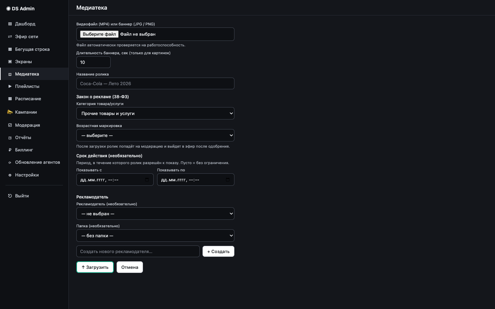

Файл (MP4 или баннер JPG/PNG) + название. Обязательна **декларация категории по
38-ФЗ**; в зависимости от категории появляются поля: возрастная маркировка,
текст обязательного предупреждения (дисклеймер), номер лицензии (финансы).
- *Служебный контент* — не реклама, в эфир без модерации.
- Запрещённые категории (табак) — загрузка **отклоняется**.
- Остальная реклама уходит **на модерацию** и выходит в эфир только после
  одобрения.
Дополнительно: срок показа «с/по», рекламодатель и папка (или без них — файл
попадёт в Общую медиатеку), длительность показа для картинок. Каждый файл
автоматически проверяется на работоспособность; одновременная загрузка
одинаковых имён безопасна.

### Общая медиатека и свои папки

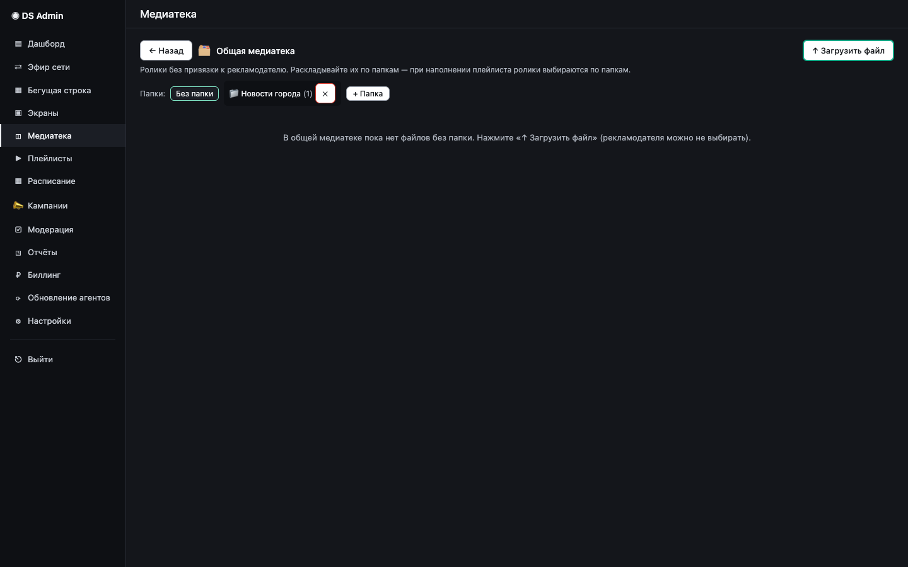

Ролики без привязки к рекламодателю. Создавайте **свои папки** («+ Папка»),
загружайте файлы сразу в папку и перекладывайте их селектом на карточке.
При наполнении плейлиста ролики выбираются **по папкам**.

### Заглушки

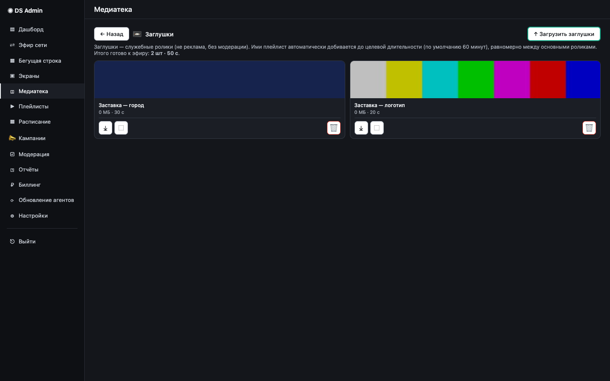

Служебные ролики-заставки (не реклама, без модерации), которыми плейлист
автоматически добивается до целевой длительности. Загрузка — сразу пачкой
(«Загрузить заглушки»), показаны длительности и итог «готово к эфиру».

---

## Плейлисты

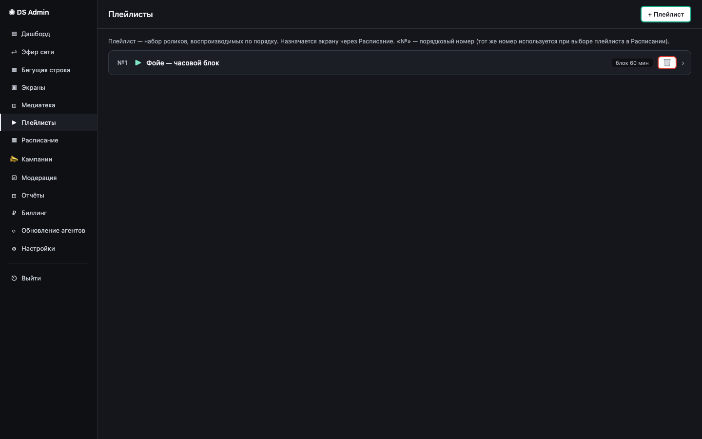

Плейлист — набор роликов по порядку; назначается экранам через Расписание.
«№» в списке — тот же номер, что при выборе плейлиста в Расписании. Бейдж
показывает режим: **«блок N мин»** или **«произвольный»**.

### Эфирный блок и заглушки

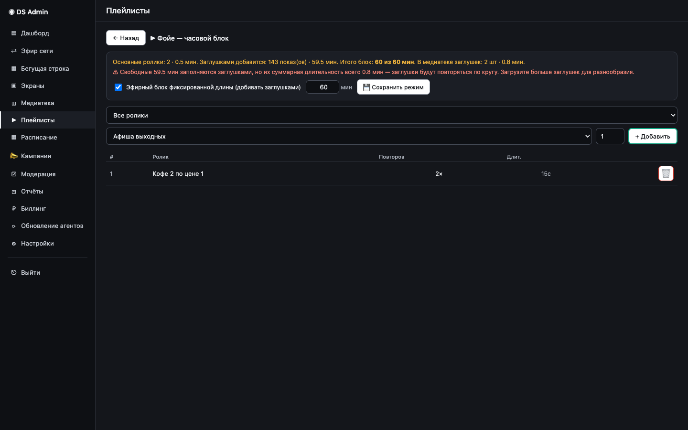

По умолчанию плейлист — **эфирный блок фиксированной длины 60 минут**
(это максимум — блок никогда не превышает цель). Если основные ролики короче,
свободное время **равномерно** заполняется заглушками между основными
роликами. Панель показывает расчёт (основные · заглушками добавится · итого)
и **предупреждает**, если: основные ролики длиннее цели; заглушек нет; их
суммарного времени не хватает (будут повторяться по кругу).

Галочка «Эфирный блок фиксированной длины» снимается — плейлист становится
**произвольным** (играет как есть). Целевая длительность меняется там же
(1–1440 мин).

Добавление ролика — **по папкам**: сначала папка (Общая / своя папка /
рекламодатель), затем ролик и число повторов. Один и тот же ролик нельзя
добавить в плейлист дважды; если ролик уже используется в другом плейлисте —
панель предупредит.

---

## Расписание

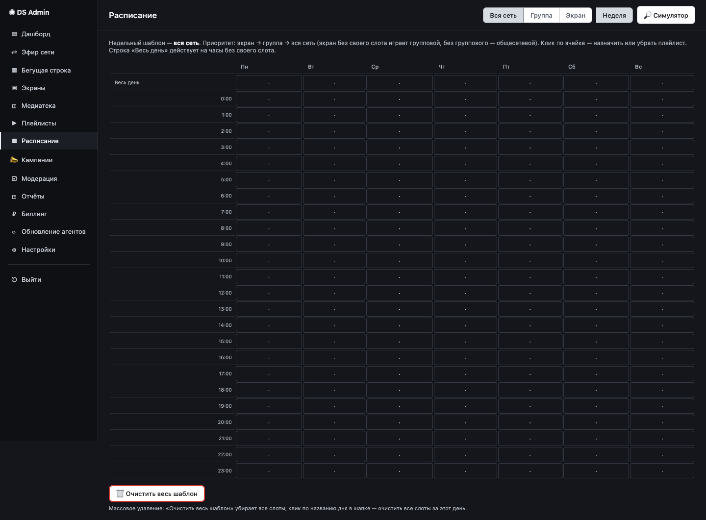

Недельный шаблон (сетка «день × час», время МСК) на трёх уровнях:
- **Экран** — конкретному экрану;
- **Группа** — всем экранам группы;
- **Сеть** — всей сети.
Более узкий уровень переопределяет более широкий (экран > группа > сеть).
Поверх шаблона — **переопределения на конкретные даты** (календарь месяца);
«Сбросить переопределения месяца» возвращает шаблон.

Инструменты:
- **⧉ Скопировать расписание экрана…** — перенести шаблон на другой экран;
- массовое удаление: **«Очистить весь шаблон»**, клик по названию дня — очистить
  день, галочки — удалить выбранные слоты;
- **🔎 Симулятор** — что реально будет играть на экране в выбранный час
  (с учётом всех уровней, дат, модерации и типа площадки); подсвечивает
  источник: сеть / фолбэк / пусто.

---

## Эфир сети

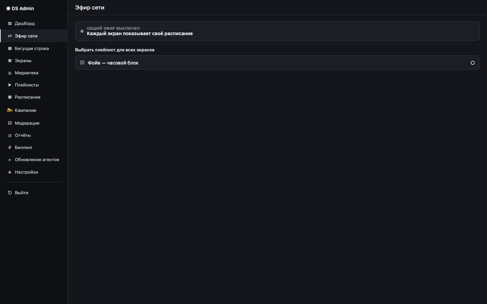

Общий эфир: один плейлист на **всю сеть** одновременно (общесетевые объявления,
акции). Пока включён — перебивает индивидуальные расписания; «Снять общее» —
вернуть каждому экрану своё.

---

## Бегущая строка

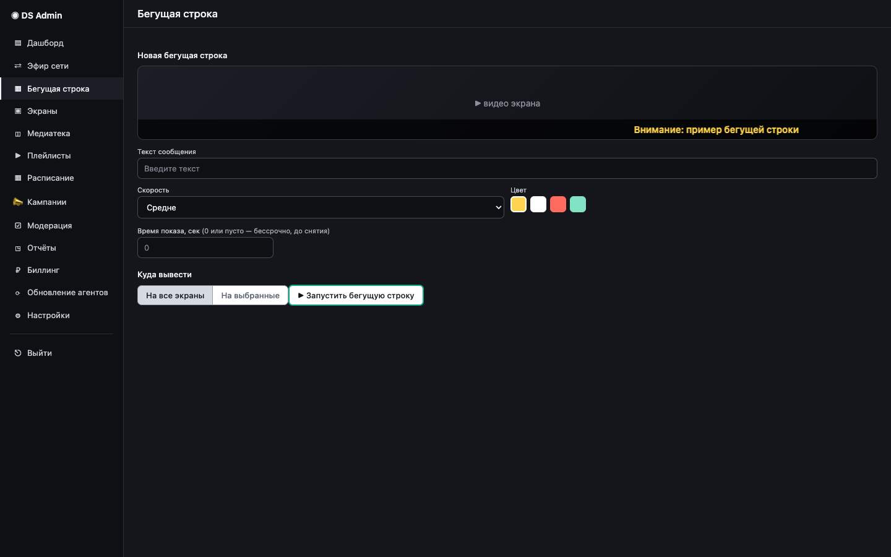

Текстовый тикер поверх видео: **текст, цвет, скорость, время показа** (0 или
пусто — бессрочно, до снятия). «Запустить бегущую строку» / «Снять». Строка
рисуется плеером mpv на всех экранах.

> Строка живёт, пока идёт показ, при котором её запустили: при команде
> **«Стоп»** или **смене плейлиста** (кончился слот, включили другой
> плейлист/эфир) задание снимается **автоматически** и фиксируется в журнале.
> Для нового показа строку запускают заново.

---

## Кампании

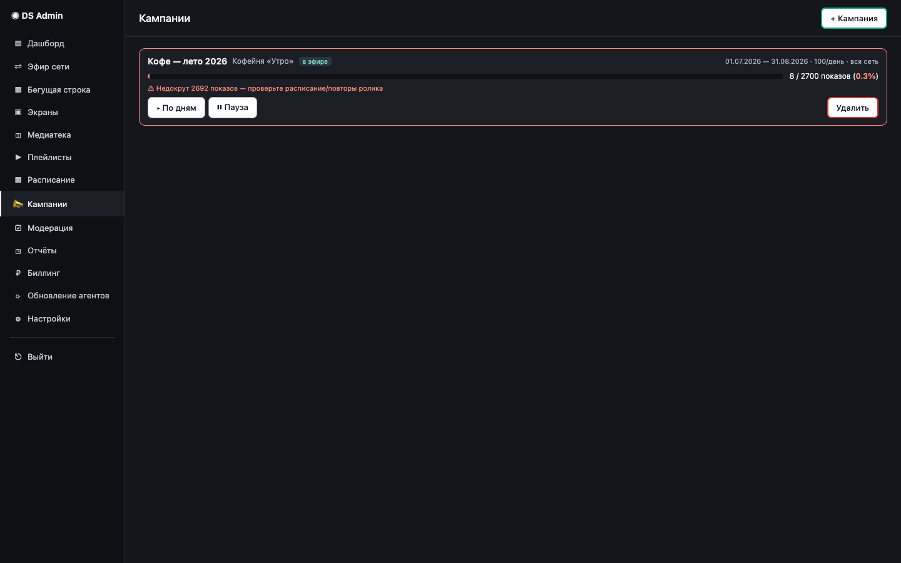

Рекламная кампания = рекламодатель + период + **план показов в день**.
Панель считает **план/факт** (по журналу показов), развёртку «по дням», охват
экранов; KPI и «истекающие KPI» видны в отчётах. Кампанию можно поставить на
**паузу** и возобновить.

При создании кампании обязательно фиксируются индивидуальные финансовые
условия: тариф **за показ** или **за минуту**, цена единицы, ручная скидка и
её основание. По умолчанию подставляется шаблон выбранного рекламодателя, но
после создания условия принадлежат кампании и не меняются вслед за шаблоном.
Кнопка **«₽ Условия»** открывает отдельную форму и изменяет их с записью
старых и новых значений в журнал операций. Скидка не может сделать итог
отрицательным.

---

## Модерация

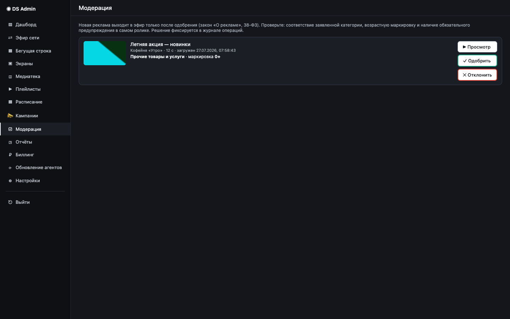

Проверка рекламы по 38-ФЗ: `pending → approved/rejected`. Обычно этим занимается
[модератор](05_РОЛЬ_МОДЕРАТОР.md), но у администратора то же право. «Просмотр» —
посмотреть сам ролик; при отклонении указывается причина. Каждое решение
фиксируется в журнале операций. В эфир идут **только одобренные** ролики.

---

## Отчёты

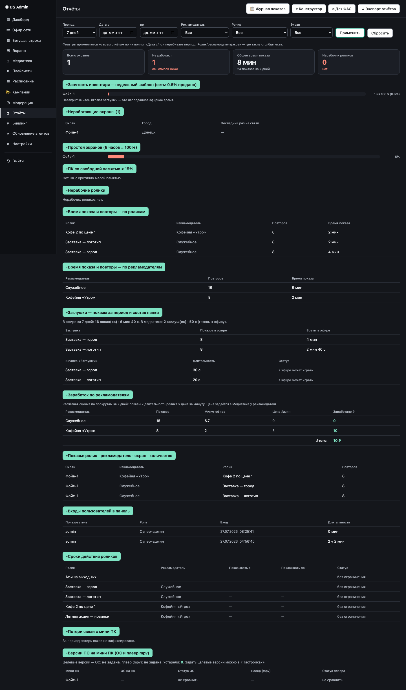

Сверху — **единая панель фильтров** (период/даты, рекламодатель, ролик, экран,
**день недели**), применяется ко всем отчётам по показам. Все метки времени в
панели показываются с днём недели («пн, 27.07.2026, 13:00»). Дополнительно у **каждой таблицы** — свой
строковый фильтр («🔍 Фильтр по этой таблице…») и **сортировка кликом по
заголовку столбца** (повторный клик меняет направление). Секции сворачиваются
кликом по заголовку:

- **Занятость инвентаря** — сколько часов недельного шаблона продано, по экранам;
- **Неработающие экраны**, **Простой экранов**, **ПК со свободной памятью <15%**;
- **Нерабочие ролики** (ошибки воспроизведения);
- **Время показа и повторы** — по роликам и по рекламодателям;
- **Заглушки** — показы заставок за период (всего и по каждой) + состав папки;
- **Заработок по рекламодателям** (показы × длительность × ₽/мин);
- **Показы: ролик · рекламодатель · экран**;
- **Входы пользователей в панель**, **Сроки действия роликов**,
  **Потери связи с мини-ПК**, **Версии ПО на мини-ПК** (ОС и mpv).

Кнопки сверху: **📋 Журнал показов** (сырой лог: дата, **день недели**, время,
экран, ролик, рекламодатель — с теми же фильтрами, включая день недели;
столбец «День» попадает и в выгрузки Excel/PDF),
**⚒ Конструктор** (собрать свой отчёт и сохранить его),
**⚖ Для ФАС** (выгрузка для контролирующих органов: декларации, решения
модерации, показы), **↓ Экспорт отчётов**.

---

## Биллинг

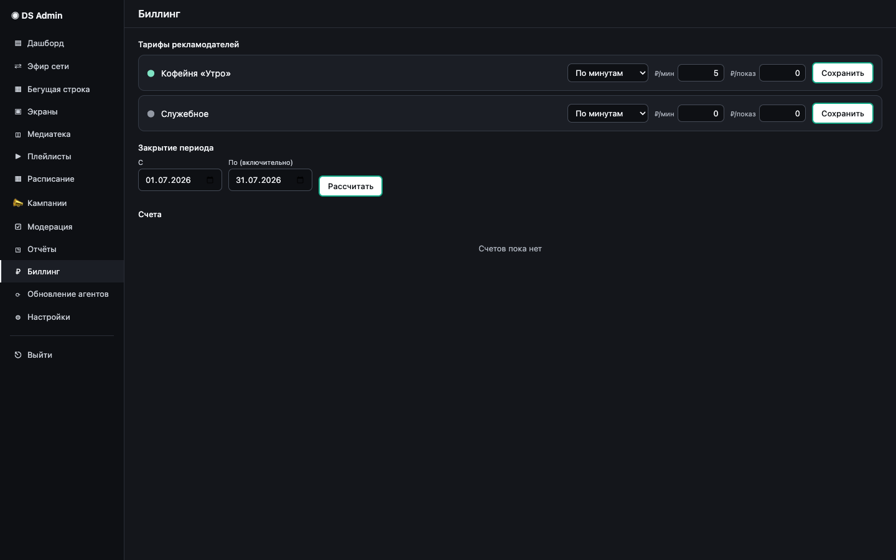

Счета рекламодателям по фактическим показам:
- сверху задаются **шаблоны** тарифа и цены для новых кампаний; существующие
  кампании от изменения шаблона не пересчитываются;
- в кампании способ расчёта — «за минуту» или «за показ»;
- «Рассчитать» за период → «Выставить счёт»;
- **▸ Ролики** — детализация счёта по каждому ролику;
- **Скидка/доплата** с примечанием (например, за простой экранов);
- «Скачать PDF», отметка **«Оплачен»** / «Вернуть», удаление.

Оплаты регистрируются администратором вручную. Рекламодатель видит результат,
но не может менять тариф, скидку, счёт или состояние оплаты.

---

## Обновление агентов (OTA)

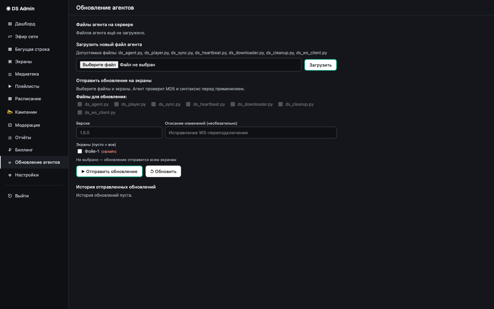

Централизованный раскат новой версии агента на мини-ПК: загрузить изменённые
`.py`-модули (панель покажет размер и MD5), указать версию и changelog, выбрать
экраны галочками → «Отправить». Агент проверяет контрольные суммы и синтаксис,
делает резервную копию и при любой ошибке **откатывается сам**. Подробно —
[07_ОБНОВЛЕНИЕ_АГЕНТА](07_ОБНОВЛЕНИЕ_АГЕНТА.md). Раскатывайте поэтапно:
сначала 1–2 пилотных экрана.

---

## Настройки

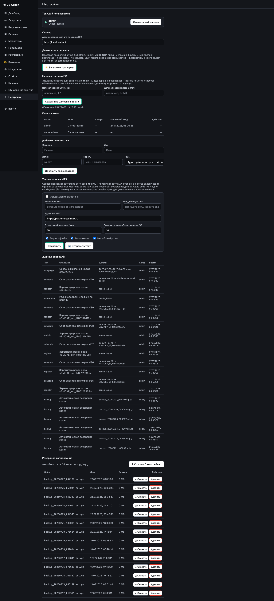

- **Текущий пользователь** — сменить свой пароль.
- **Сервер** — адрес API для агентов мини-ПК.
- **Диагностика сервера** — «Запустить проверку»: БД, миграции, Redis, Celery,
  MinIO, NTP, диски, свежесть бэкапа, экраны и ролики — каждый пункт со
  статусом и подсказкой «что сделать». Если панель вообще не открывается —
  диагностику с хоста делает `selfheal.sh`
  (см. [runbook §0](../Техдокументация/03_RUNBOOK_ИНЦИДЕНТЫ.md)).

  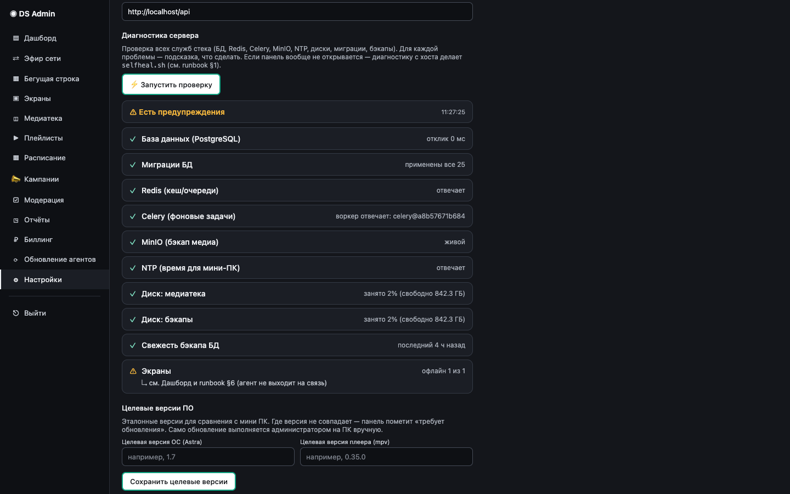

- **Целевые версии ПО** — эталонные версии ОС (Astra) и плеера (mpv): где не
  совпадает, панель пометит «требует обновления» (отчёт «Версии ПО»).
- **Пользователи** (только `superadmin`): создать (логин, пароль, имя, роль
  *Админ / Аудитор / Модератор / Рекламодатель*), редактирование,
  блокировка/разблокировка, смена пароля, удаление.
  При выборе роли **«Рекламодатель»** появляется поле **«Наименование
  рекламодателя»** — под этим именем сразу заводится кабинет, и оно же пойдёт
  в акт и эфирную справку. Если рекламодатель с таким наименованием уже есть в
  медиатеке, учётка привяжется к нему (дубль не создаётся). Оставите поле
  пустым — возьмём фамилию и имя из учётной записи.
  При создании или открытии кабинета система автоматически создаёт и
  восстанавливает две папки: **«Видеореклама»** и **«Документы»**.
  Имя можно изменить кнопкой **«✎»** в списке рекламодателей или кнопкой
  **«Изменить имя»** в карточке. Связанные ролики, кампании и учётка сохраняются.
  Удаление такого пользователя **не удаляет кабинет**: в нём ролики, счета и
  документы. Кабинет удаляется отдельно, в Медиатеке.
- **Уведомления (MAX)**: токен бота, адрес, порог офлайна, выбор событий,
  тест. Подробно — [01, §6](01_УСТАНОВКА_СЕРВЕР.md#6-настройка-max-уведомлений-необязательно).
- **Журнал операций** — полный аудит: кто, когда и что сделал.
- **Резервное копирование** — автобэкап БД (раз в 24 ч) и медиа (MinIO);
  «Создать бэкап сейчас», скачать или удалить архив. Доступ к полным дампам
  есть только у `admin`/`superadmin`; API проверяет роль даже при прямом
  запросе, а скачивание и удаление фиксируются в журнале операций.
  Восстановление — [RESTORE_GUIDE](../RESTORE_GUIDE.md).

---

## Типовой полный цикл

1. Завести экраны, раздать токены, поставить агенты ([02](02_УСТАНОВКА_АГЕНТ.md)).
2. Задать типы площадок и группы экранов; настроить питание/громкость.
3. Загрузить заглушки (Медиатека → Заглушки) — они добивают эфирные блоки.
4. Загрузить ролики с декларацией категорий (38-ФЗ) → модерация.
5. Собрать плейлисты (обычно «блок 60 мин»), поставить в расписание
   (экран/группа/сеть) с датами; проверить симулятором.
6. Завести кампании с планом; следить за план/фактом.
7. Следить за Дашбордом и уведомлениями; снимать отчёты и счета.
8. Регулярно: Настройки → «Запустить проверку» и контроль бэкапов.

Ежедневная рутина сжато — в [руководстве оператора](06_РОЛЬ_ОПЕРАТОР.md).
Отказы и лечение — в [runbook](../Техдокументация/03_RUNBOOK_ИНЦИДЕНТЫ.md).
